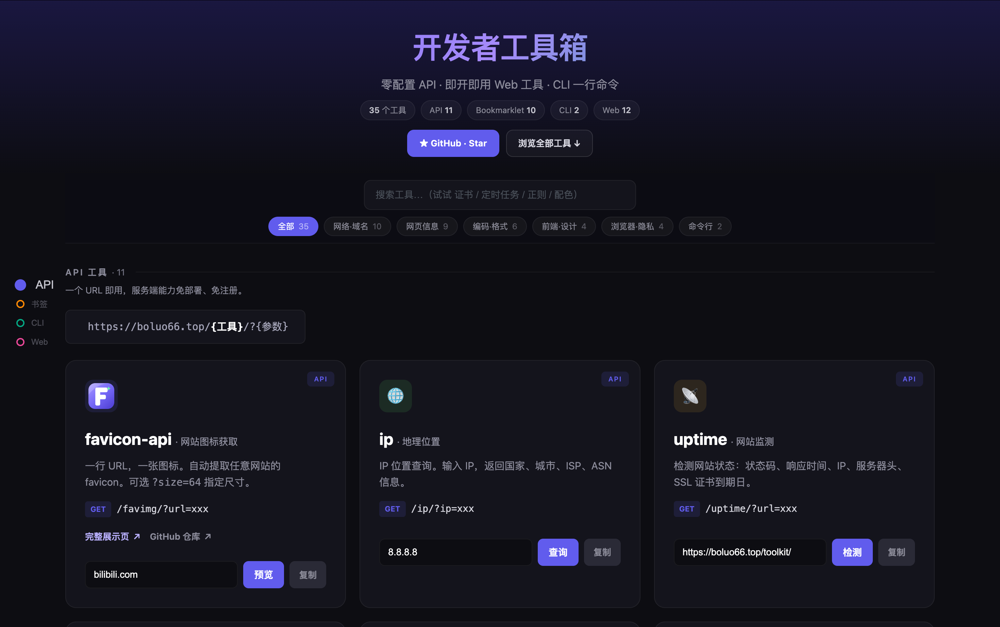

<h1 align="center">🛠 Boluo Developer Toolkit · Free Online Developer Tools</h1>

<p align="center">
  One place for everyday developer tasks —— <b>no install · no signup · ready to use</b><br>
  <sub>Free Online Developer Toolkit · API · Bookmarklet · CLI · Web Tools</sub>
</p>

<p align="center">
  <a href="https://boluo66.top/toolkit/"></a>
  
  
  <a href="https://github.com/VeteranBoLuo/tools/stargazers"></a>
</p>

<p align="center">
  <a href="README.md"></a>
  
  <a href="README.ja.md"></a>
  <a href="README.ko.md"></a>
</p>

<p align="center">
  <a href="https://boluo66.top/toolkit/"></a>
</p>

> [!NOTE]
> Find the latest Boluo Developer Toolkit tools and their entry points here. Every tool is free to use from the [online toolkit](https://boluo66.top/toolkit/).

---

## ✨ Highlights

A few that are hard to find elsewhere, or just feel really smooth:

- **🌐 myip · My IP** — more than an IP lookup. Cross-checks several domestic & international echo sources at once, so you can **tell at a glance whether you're behind a proxy or split routing** (source A sees one IP, source B sees another). Plus IPv6 and WebRTC local-address probing.
- **🔒 cert · SSL inspector** — full certificate chain, SAN list, key type, TLS version, days-until-expiry, all from one URL.
- **🌍 dnsprop · DNS propagation** — changed a DNS record and wondering if it's live yet? Queries Cloudflare / Google / Quad9 + AliDNS / DNSPod / 114 (7 resolvers) in parallel and compares.
- **📖 read · Article extractor** — strip ads, nav and sidebars; keep only the clean article body of any page.
- **🔀 trace · Redirect tracer** — the full redirect chain with every hop's status code, timing and Location. Great for debugging 301/302.

---

## Why this toolkit

Everyday scenarios you probably know too well:

- **Need a site's favicon?** Open the browser → inspect element → dig around, or just `GET /favimg/?url=xxx`
- **Did my DNS change propagate?** Switching resolvers one by one is tedious — `GET /dnsprop/?domain=xxx` compares 7 at once
- **Page blocks copy/paste?** Open the console → find the unlock snippet, or just drag a Bookmarklet and click once
- **Where's this page slow?** No need to open DevTools → Network; drag the `perf` bookmarklet and the timings and resource sizes are right there
- **How many lines of code total?** `npx git-heat` prints a year-in-review in one command

**Each tool solves one concrete problem, then gets out of your way.**

---

## 📦 Tools

### API — change the URL, get the result

All APIs accept `GET`, return JSON or an image. **No SDK, no auth** — usable from any language/platform:

```html
<!-- Embed straight into a site with  -->


<!-- Call it from a page with fetch -->
fetch('https://boluo66.top/ip/?ip=8.8.8.8').then(r => r.json())

<!-- One line in the terminal -->
curl "https://boluo66.top/dnsprop/?domain=github.com"
```

| Tool | Example | Returns | Notes |
|---|---|---|---|
| **favicon-api** | `GET /favimg/?url=xxx` | image | one URL, one favicon |
| **ip** | `GET /ip/?ip=xxx` | JSON | country, city, ISP, ASN; supports `&lang=zh-CN` |
| **uptime** | `GET /uptime/?url=xxx` | JSON | status code, latency, SSL expiry |
| **security** | `GET /security/?url=xxx` | JSON | 9 security headers weighted-scored + TLS analysis |
| **cert** | `GET /cert/?host=xxx` | JSON | full chain, SAN, key type, TLS version |
| **trace** | `GET /trace/?url=xxx` | JSON | full redirect chain + per-hop timing + final headers |
| **dns** | `GET /dns/?domain=xxx&type=A` | JSON | 10 record types, real TTL for A/AAAA |
| **dnsprop** | `GET /dnsprop/?domain=xxx` | JSON | 7 global/domestic resolvers compared in parallel |
| **whois** | `GET /whois/?domain=xxx` | JSON | registrar, created/expiry dates, name servers |
| **metadata** | `GET /metadata/?url=xxx` | JSON | title, OG tags, favicon, h1-h3, all links |
| **read** | `GET /read/?url=xxx` | JSON | Mozilla Readability clean article body |

### Bookmarklet — drag to your bookmarks bar, use anywhere

Runs on **any page** with one click, all client-side, nothing uploaded:

| Tool | What it does |
|---|---|
| **perf** | that page's load timings (DNS/TCP/TTFB/DOM/full load) + resource count & size |
| **seo** | title/description length, H1, canonical, missing `alt`, OG, word count — pass/warn/fail |
| **table2csv** | grab any `<table>` on the page, copy or download it as CSV |
| **linkcheck** | scan all links on the page, flag broken ones |
| **all-links** | extract every link on the current page |
| **imgextract** | pull all images, with ZIP download |
| **cookies** | view, search, edit, delete cookies |
| **lsstorage** | view, search, edit, delete localStorage |
| **panda** | grayscale the page to cut visual noise |
| **uncopy** | unlock copy / right-click / text selection |

> How to use: open the [toolkit page](https://boluo66.top/toolkit/), drag the button to your bookmarks bar, then click it on any page later.

### CLI — one command

| Tool | Command |
|---|---|
| **git-heat** | `npx git-heat` |
| **rmport** | `npx rmport 3000` |

### Web tools — open and go

| Tool | What it does | |
|---|---|---|
| **myip** | public IP + multi-source domestic/international comparison + split-routing check | [→ open](https://boluo66.top/toolkit/myip.html) |
| **jwt** | decode header/payload + verify HS256 signature | [→ open](https://boluo66.top/toolkit/jwt.html) |
| **cidr** | CIDR → network / mask / broadcast / host count | [→ open](https://boluo66.top/toolkit/cidr.html) |
| **hash** | MD5 / SHA / Base64 / URL encode & decode | [→ open](https://boluo66.top/toolkit/hash.html) |
| **cron** | translate a crontab expr + next run times | [→ open](https://boluo66.top/toolkit/cron.html) |
| **code-preview** | paste code, export a pretty screenshot | [→ open](https://boluo66.top/toolkit/code-preview.html) |
| **timestamp** | Unix timestamp ↔ date | [→ open](https://boluo66.top/toolkit/timestamp.html) |
| **palette** | one color → 8 palettes | [→ open](https://boluo66.top/toolkit/palette.html) |
| **diff** | highlight differences between two texts | [→ open](https://boluo66.top/toolkit/diff.html) |
| **regex-tester** | live matching + groups + count | [→ open](https://boluo66.top/toolkit/regex-tester.html) |
| **api-playground** | fire REST requests in the browser | [→ open](https://boluo66.top/toolkit/api-playground.html) |
| **mermaid-editor** | write Mermaid, live preview, export SVG/PNG | [→ open](https://boluo66.top/toolkit/mermaid-editor.html) |

---

## 🔒 Privacy & implementation

- **API tools**: most use lightweight implementations with no third-party runtime dependencies; the server blocks internal/reserved addresses (SSRF protection). Article extraction uses Mozilla Readability and jsdom.
- **Bookmarklet / Web tools**: most features run locally in your browser; tools that need network access send only the requests required for the action you initiate.

---

<p align="center">
  If these tools help you, a ⭐ Star is much appreciated ✨<br>
  Want another tool? <a href="https://github.com/VeteranBoLuo/tools/issues">Open an issue →</a>
</p>
